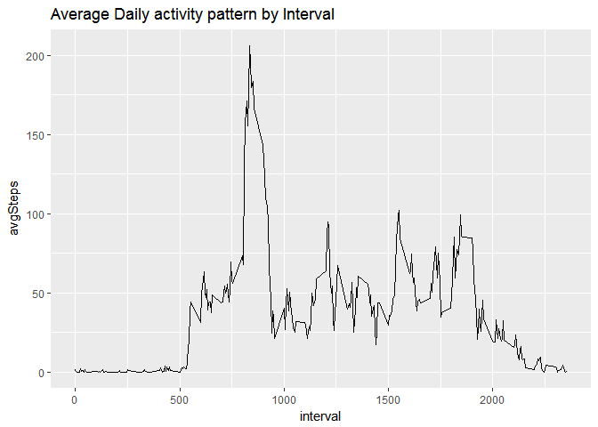

# Reproducible Research: Peer Assessment 1

### Load the required libraries:

```r
library(dplyr)
```

```
## 
## Attaching package: 'dplyr'
```

```
## The following objects are masked from 'package:stats':
## 
##     filter, lag
```

```
## The following objects are masked from 'package:base':
## 
##     intersect, setdiff, setequal, union
```

```r
library(ggplot2)
```

```
## Warning: package 'ggplot2' was built under R version 3.3.2
```

```r
library(lubridate)
```

```
## Warning: package 'lubridate' was built under R version 3.3.2
```

```
## 
## Attaching package: 'lubridate'
```

```
## The following object is masked from 'package:base':
## 
##     date
```

```r
library(chron)
```

```
## Warning: package 'chron' was built under R version 3.3.2
```

```
## 
## Attaching package: 'chron'
```

```
## The following objects are masked from 'package:lubridate':
## 
##     days, hours, minutes, seconds, years
```

## Loading and preprocessing the data

```r
zipFile <- "activity.zip"
csvFile <- "activity.csv"
if(!file.exists(file.path(csvFile))){unzip(file.path(zipFile))}
activity <- read.csv(csvFile, stringsAsFactors = FALSE)
head(activity)
```

```
##   steps       date interval
## 1    NA 2012-10-01        0
## 2    NA 2012-10-01        5
## 3    NA 2012-10-01       10
## 4    NA 2012-10-01       15
## 5    NA 2012-10-01       20
## 6    NA 2012-10-01       25
```


## What is mean total number of steps taken per day?

```r
dates <- activity$date
steps <- activity$steps
stepsByDate <- aggregate(steps, list(dates), FUN = sum)
head(stepsByDate)
```

```
##      Group.1     x
## 1 2012-10-01    NA
## 2 2012-10-02   126
## 3 2012-10-03 11352
## 4 2012-10-04 12116
## 5 2012-10-05 13294
## 6 2012-10-06 15420
```

```r
names(stepsByDate)
```

```
## [1] "Group.1" "x"
```

```r
colnames(stepsByDate) <- c("Date", "TotalSteps")
names(stepsByDate)
```

```
## [1] "Date"       "TotalSteps"
```

### 1. Make a histogram of the total number of steps taken each day

```r
hist(stepsByDate$TotalSteps, xlab = "Total Steps per Day", main = "Histogram of total steps per day")
```

<!-- -->

### 2. Calculate and report the mean and median total number of steps taken per day

```r
mean(stepsByDate$TotalSteps, na.rm = TRUE)
```

```
## [1] 10766.19
```

```r
median(stepsByDate$TotalSteps, na.rm = TRUE)
```

```
## [1] 10765
```


## What is the average daily activity pattern?

### 1. Make a time series plot (i.e. type = "l") of the 5-minute interval (x-axis) and the average number of steps taken, averaged across all days (y-axis)

```r
avgStepsByInt <- activity %>% filter(!is.na(steps)) %>% group_by(interval) %>%summarize(avgSteps = mean(steps))
head(avgStepsByInt)
```

```
## # A tibble: 6 × 2
##   interval  avgSteps
##      <int>     <dbl>
## 1        0 1.7169811
## 2        5 0.3396226
## 3       10 0.1320755
## 4       15 0.1509434
## 5       20 0.0754717
## 6       25 2.0943396
```

```r
ggplot(avgStepsByInt, aes(interval, avgSteps)) + geom_line() + ggtitle("Average Daily activity pattern by Interval")
```

<!-- -->

###2. Which 5-minute interval, on average across all the days in the dataset, contains the maximum number of steps?

```r
filter(avgStepsByInt, avgSteps == max(avgStepsByInt$avgSteps))
```

```
## # A tibble: 1 × 2
##   interval avgSteps
##      <int>    <dbl>
## 1      835 206.1698
```


## Imputing missing values

### 1. Calculate and report the total number of missing values in the dataset (i.e. the total number of rows with NAs)

```r
sum(is.na(activity$steps))
```

```
## [1] 2304
```

### 2. Devise a strategy for filling in all of the missing values in the dataset. 
The strategy does not need to be sophisticated. For example, you could use
the mean/median for that day, or the mean for that 5-minute interval, etc.

### 3. Create a new dataset that is equal to the original dataset but with the missing data filled in.

```r
completeActivity <- activity
length(which(is.na(completeActivity$steps)))
```

```
## [1] 2304
```

```r
head(completeActivity)
```

```
##   steps       date interval
## 1    NA 2012-10-01        0
## 2    NA 2012-10-01        5
## 3    NA 2012-10-01       10
## 4    NA 2012-10-01       15
## 5    NA 2012-10-01       20
## 6    NA 2012-10-01       25
```

```r
completeActivity$steps[which(is.na(completeActivity$steps))] <- avgStepsByInt$avgSteps
length(which(is.na(completeActivity$steps)))
```

```
## [1] 0
```

```r
head(completeActivity)
```

```
##       steps       date interval
## 1 1.7169811 2012-10-01        0
## 2 0.3396226 2012-10-01        5
## 3 0.1320755 2012-10-01       10
## 4 0.1509434 2012-10-01       15
## 5 0.0754717 2012-10-01       20
## 6 2.0943396 2012-10-01       25
```

### 4. Make a histogram of the total number of steps taken each day and 
Calculate and report the mean and median total number of steps taken per day. Do
these values differ from the estimates from the first part of the assignment?
What is the impact of imputing missing data on the estimates of the total
daily number of steps?


```r
completeStepsByDate <- aggregate(completeActivity$steps, list(completeActivity$date), FUN = sum)
names(completeStepsByDate)
```

```
## [1] "Group.1" "x"
```

```r
colnames(completeStepsByDate) <- c("Date", "TotalSteps")
head(completeStepsByDate)
```

```
##         Date TotalSteps
## 1 2012-10-01   10766.19
## 2 2012-10-02     126.00
## 3 2012-10-03   11352.00
## 4 2012-10-04   12116.00
## 5 2012-10-05   13294.00
## 6 2012-10-06   15420.00
```

```r
hist(completeStepsByDate$TotalSteps, xlab = "Total Steps per Day", main = "Histogram of total steps per day")
```

<!-- -->

```r
mean(completeStepsByDate$TotalSteps, na.rm = TRUE)
```

```
## [1] 10766.19
```

```r
median(completeStepsByDate$TotalSteps, na.rm = TRUE)
```

```
## [1] 10766.19
```


## Are there differences in activity patterns between weekdays and weekends?

###1. Create a new factor variable in the dataset with two levels - "weekday" and "weekend" 
indicating whether a given date is a weekday or weekend day.


```r
str(completeActivity)
```

```
## 'data.frame':	17568 obs. of  3 variables:
##  $ steps   : num  1.717 0.3396 0.1321 0.1509 0.0755 ...
##  $ date    : chr  "2012-10-01" "2012-10-01" "2012-10-01" "2012-10-01" ...
##  $ interval: int  0 5 10 15 20 25 30 35 40 45 ...
```

```r
completeActivity$date <- as.Date(completeActivity$date)
str(completeActivity)
```

```
## 'data.frame':	17568 obs. of  3 variables:
##  $ steps   : num  1.717 0.3396 0.1321 0.1509 0.0755 ...
##  $ date    : Date, format: "2012-10-01" "2012-10-01" ...
##  $ interval: int  0 5 10 15 20 25 30 35 40 45 ...
```

```r
completeActivity$Day <- weekdays(completeActivity$date)
str(completeActivity)
```

```
## 'data.frame':	17568 obs. of  4 variables:
##  $ steps   : num  1.717 0.3396 0.1321 0.1509 0.0755 ...
##  $ date    : Date, format: "2012-10-01" "2012-10-01" ...
##  $ interval: int  0 5 10 15 20 25 30 35 40 45 ...
##  $ Day     : chr  "Monday" "Monday" "Monday" "Monday" ...
```

```r
completeActivity$DayType <- ifelse(is.weekend(completeActivity$date), "Weekend", "Weekday")
str(completeActivity)
```

```
## 'data.frame':	17568 obs. of  5 variables:
##  $ steps   : num  1.717 0.3396 0.1321 0.1509 0.0755 ...
##  $ date    : Date, format: "2012-10-01" "2012-10-01" ...
##  $ interval: int  0 5 10 15 20 25 30 35 40 45 ...
##  $ Day     : chr  "Monday" "Monday" "Monday" "Monday" ...
##  $ DayType : chr  "Weekday" "Weekday" "Weekday" "Weekday" ...
```

```r
head(completeActivity)
```

```
##       steps       date interval    Day DayType
## 1 1.7169811 2012-10-01        0 Monday Weekday
## 2 0.3396226 2012-10-01        5 Monday Weekday
## 3 0.1320755 2012-10-01       10 Monday Weekday
## 4 0.1509434 2012-10-01       15 Monday Weekday
## 5 0.0754717 2012-10-01       20 Monday Weekday
## 6 2.0943396 2012-10-01       25 Monday Weekday
```


### 2. Make a panel plot containing a time series plot (i.e. type = "l")
of the 5-minute interval (x-axis) and the average number of steps taken, averaged
across all weekday days or weekend days (y-axis).


```r
byDayType <- completeActivity %>% group_by(interval, DayType) %>% summarize(steps = mean(steps))
head(byDayType)
```

```
## Source: local data frame [6 x 3]
## Groups: interval [3]
## 
##   interval DayType      steps
##      <int>   <chr>      <dbl>
## 1        0 Weekday 2.25115304
## 2        0 Weekend 0.21462264
## 3        5 Weekday 0.44528302
## 4        5 Weekend 0.04245283
## 5       10 Weekday 0.17316562
## 6       10 Weekend 0.01650943
```

```r
ggplot(byDayType, aes(x=interval, y=steps, color=DayType)) + geom_line() + facet_wrap(~DayType, ncol=1, nrow=2)
```

<!-- -->

